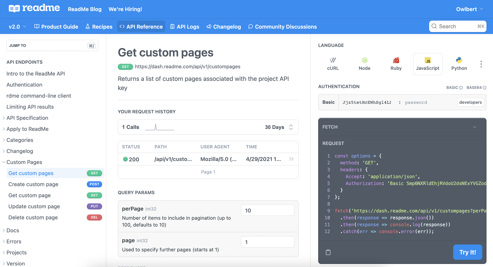

# Guia para Design de APIs

## Documentação

Uma API pode ser usada sem uma boa documentação? Com certeza, embora seja por meio das práticas recomendadas da documentação da API que os desenvolvedores experimentam pela primeira vez uma API e conhecem sua funcionalidade.[^1]

Portanto, além das documentações de APIs orientarem os trabalhos dos usuários estão em contato direto com elas, elas também são utilizadas para decisões de negócio, ou seja, através das documentações das APIS é possível explorar quais produtos e serviços existem no portifólio da empresa, por pessoas como CTOs and Product Owners e tomar diversas decisões. [^2]

### O que precisa ter na minha documentação?

- **Autenticação**: Devem ser fornecidas as informações sobre como utilizar o esquema de autenticação. A maioria das APIs possui sistema de autenticação, em que os consumidores precisam se autenticar para obter acesso. Certifique-se de realizar uma boa documentação dessa sessão para que os usuários consigam se autenticar. [^2]

- **Recursos**: Liste todos os recursos e procure entender qual a melhor forma dos consumires se integrarem com os recursos que você oferece e montar exemplos de uso dos seus recursos. [^2]

- **Requisições e Respostas**: Forneça na documentação o ciclo de requisição e resposta que o recurso merece. Ter muita informação disponível para o consumidor final nunca é um problema, especialmente quando eles estão tentando integrar seus serviços, então descreva os ciclos dos recursos em detalhes. Documente cada chamada que sua API pode oferecer, com contexto em torno dos parâmetros e respostas. [^2]

- **[Tratamento de Erros](error-handling.md)**: Não se esqueça de criar um padrão de tratamento de erros e documenta-lo em sua API, dessa forma você ajuda o consumidor a ter uma melhor experiência e mais segurança.

### Swagger e OpenAPI

Tudo começou em 2011 quando Tony Tam percebeu a necessidade de uma documentação mais automatizada em um dos projeto em que trabalhava, ele iniciou a representação da documentação utilizando o formato JSON, aproveitando a flexibilidade do estilo de arquitetura REST e usando muitos recursos de ferramentas criadas para o protocolo SOAP. No mesmo ano de criação o Swagger API se tornou um projeto aberto, com interface e um validador autônomo. Somente em 2016 esse projeto foi renomeado e passou a se chamar [OpenAPI Specification](https://github.com/OAI/OpenAPI-Specification). [^3]

Aplicativos implementados com base em arquivos de interface OpenAPI podem gerar automaticamente documentação de métodos, parâmetros e modelos. Isso ajuda a manter a documentação, as bibliotecas de cliente e o código-fonte sincronizados. Além disso o OpenAPI é independente de linguagem, dessa forma os clientes podem entender e consumir os serviços sem conhecimento sobre o código. Hoje o OpenAPI é utilizado em [diversos projetos](https://github.com/OAI/OpenAPI-Specification/blob/main/IMPLEMENTATIONS.md#implementations) ao redor do mundo. [^4]

### Ferramentas para documentação

Existem diversos de tipos de ferramentas para realizar a documentação de APIs atualmente, você pode buscar o que melhor se adaptar a sua necessidade. Segue abaixo algumas opções para documentação de APIs:

### Documento no Google Drive

Os [documentos do Google](https://www.google.com/intl/pt-BR/docs/about/), são telas em branco, para que sejam criados diversos tipos de documentos diferentes. Caso você queira pode começar a desenhar os contratos dos recursos da sua API, corpos da requisição e resposta, códigos de estado, etc. Mesmo não sendo automatizado ou ideal, ele pode ser compartilhado com os membros do time, para que todos possam interagir com o documento,  até chegar em um padrão de documento que agrade a todos. Após a documentação ser validada, o time pode começar a usar uma ferramenta mais automatizada, o mais importante sempre é que a documentação seja bem completa.

### ReadMe

O [ReadMe](https://readme.com/documentation) é uma ferramenta para gerenciamento e criação de documentação. Se você possuir um arquivo Swagger/OpenAPI, você consegue gerar automaticamente um modelo de referência da sua documentação. [^5]

  Exemplo de documentação com o ReadMe 

  

  Fonte: ReadMe - API Reference Redesign (2021-2022)

### Postman

É uma plataforma de API para que desenvolvedores projetem, construam, testem e iterem suas APIs. Em abril de 2022, o Postman relata ter mais de 20 milhões de usuários registrados e 75.000 APIs abertas, que, segundo ele, constituem o maior hub de API público do mundo. [^6]

Após gerar a documentação para sua coleção ou API, os usuários podem visualizar a documentação no Postman. Por padrão, sua documentação é privada, portanto, apenas as pessoas com quem você compartilha uma coleção ou API poderão vê-la. Se você estiver criando uma API pública, poderá publicar sua documentação para disponibilizá-la publicamente para qualquer pessoa com um navegador da web. [^7]

### OpenAPI Generator

### Swagger Generator

### RAML

  

Referências:

[^1]: [API Documentation Guide and Best Practices](https://stoplight.io/api-documentation-guide)
[^2]: [Best Practices in API Documentation](https://swagger.io/blog/api-documentation/best-practices-in-api-documentation/)
[^3]: [Swagger - Wikipedia](https://en.wikipedia.org/wiki/Swagger_(software))
[^4]: [OpenAPI Specification - Wikipedia](https://en.wikipedia.org/wiki/OpenAPI_Specification)
[^5]: [ReadMe - Documentation](https://readme.com/documentation)
[^6]: [Postman - Wikipedia](https://en.wikipedia.org/wiki/Postman_(software))
[^7]: [Postman - Documenting your API](https://learning.postman.com/docs/publishing-your-api/documenting-your-api/)
