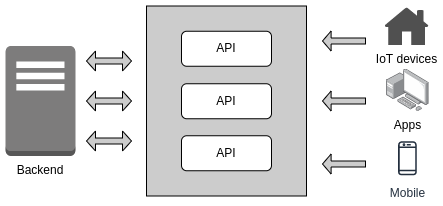

# Guia para Design de APIs

## Introdução

### O que são as APIs?

Interface de programação de aplicativos, ou APIs, permite que as empresas abram os dados e funcionalidades de seus aplicativos para desenvolvedores externos, parceiros de negócios e departamentos internos, permitindo que serviços e produtos se comuniquem e aproveitem os dados e funcionalidades uns dos outros por meio de um interface documentada.

Um dos benefícios é a facilidade de uso, já que os desenvolvedores não precisam saber como a API é implementada, eles simplesmente usam para se comunicarem com outros produtos e serviços.

O uso das APIs aumentou exponencialmente nas últimas décadas e muitos aplicativos da web populares não seriam possíveis sem elas.

  

### Alguns exemplos de APIs

**Login universal**: essas APIs populares permitem que as pessoas façam login em sites usando seus detalhes de login do perfil do Facebook, Google, Twitter, etc. Essa funcionalidade permite que qualquer site aproveite a API de um dos serviços para realizar rapidamente a autenticação do usuário, economizando tempo, dinheiro e melhorando a experiência de cadastro. 

**Processamento de pagamentos de terceiros**: por exemplo, a funcionalidade de pagar com o Paypal ou Mercado Pago, presente em diversos sites de comércio eletrônico. Isso permite que as pessoas paguem por produtos on-line sem expor dados confidenciais.

**Comparação de reservas de viagens**: os sites de viagens agregam milhares de voos, apresentando as opções mais baratas para o destino em determinada data. Esse serviço é viabilizado por APIs que fornecem aos usuários as informações mais recentes sobre hotéis e passagens aéreas. Dessa forma diminui-se drasticamente o tempo e esforço na busca por voos e acomodações disponíveis.

**Google Maps**: um dos exemplos mais comuns de uma boa API é o Google Maps, além da APIs que forneceram mapas estáticos e interativos, também fornecem aos usuário orientações e pontos de interesse. Por meio da geolocalização é possível traçar rotas de viagem e rastrear itens em movimento, como um veículo de entrega.

### Especificações e protocolos de APIs

O objetivo das especificações e protocolos de APIs é padronizar a troca de dados entre diferentes serviços na web, ou seja, capacidade de diversos sistemas escritos em diferentes linguagens e executados em diferentes sistemas operacionais se comunicarem entre si.

#### SOAP

Este protocolo foi desenvolvido pela Microsoft e segundo glossário [^1] disponibilizado pela empresa, pode-se definir SOAP como um protocolo leve para troca de informações estruturadas em um ambiente descentralizado e distribuído. Ele usa o XML para definir uma estrutura de mensagens extensível, que fornece uma construção de mensagem que pode ser trocada por uma variedade de protocolos subjacentes. A estrutura foi projetada para ser independente de qualquer modelo de programação específico e outras semânticas específicas de implementação.

#### REST

O termo REST foi criado pelo cientista da computação Roy Fielding e ao contrário do SOAP, o REST é um estilo de arquitetura de software com seis restrições [^2] para construção de aplicativos que funcionam sobre o protocolo HTTP, geralmente serviços web.

Os desenvolvedores consideram o REST uma alternativa mais simples ao SOAP, que requer escrever muito código para completar uma tarefa e seguir a estrutura XML para cada mensagem enviada. O REST segue uma lógica mais simples, pois disponibiliza os dados como recursos, cada recurso é representado por uma URL única e pode-se solicitar esse recurso fornecendo sua URL.

As APIs da web que estão de acordo com as restrições da arquitetura REST são chamadas de APIs RESTful. Essas APIs usam solicitações HTTP (verbos) para trabalhar com os recursos, por exemplo, GET, POST, PUT, DELETE, etc, além de suportarem mensagens em diversos formatos como HTML, YAML, XML e JSON, sendo o último o mais comumente utilizado.

[⬅️ voltar para menu](index.md)

[➡️ próximo tópico REST and RESTful]()

Referências:

[^1]: [Microsoft Docs Glossary](https://docs.microsoft.com/en-us/openspecs/windows_protocols/ms-wusp/5daaa9d9-26aa-42fc-a431-c011166dc58f)
[^2]: [REST API Architectural Constraints](https://www.geeksforgeeks.org/rest-api-architectural-constraints/)

